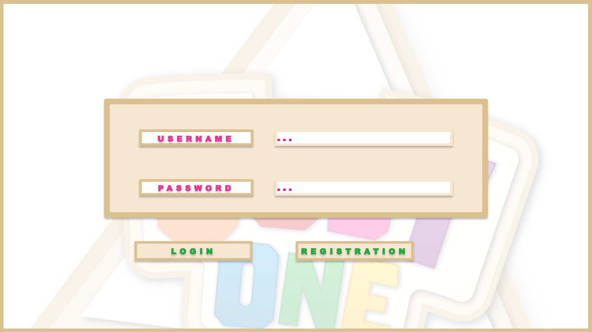
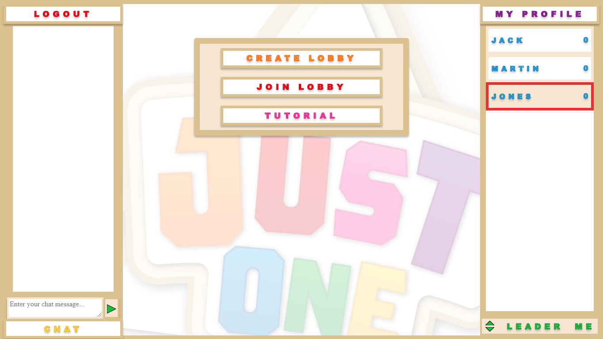
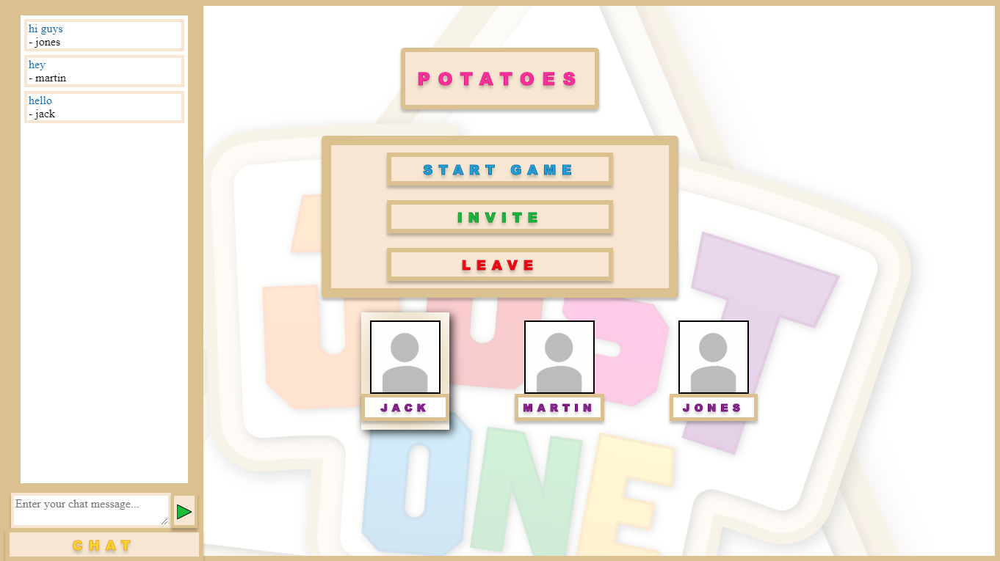
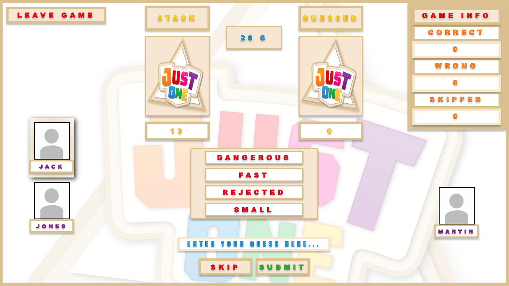

# Just One Client

Just One Client (JOC) is a client for the multiplayer game Just One. It is written to work with a server, for which the source code can be found [here](https://github.com/SOPRA-2020/server-just-one).
JOC is designed as a Single Page Application (SPA) and provides an intuitive and colorful web interface to play the game, as well as use associated functionalities, such as chatting with other users and use lobbies.

## Technologies

JOC uses the JS-based [Node.js](https://nodejs.org/en/) runtime together with the [React framework](https://reactjs.org/) for it's user interface.
It's SPA functionality is implemented using [react-router-dom](https://reacttraining.com/react-router/web/guides/quick-start).
With [styled-components](https://www.styled-components.com/docs) styled React components are created directly from styles.

## High-Level Components

JOC is highly modular, using reusable, periodically self-updating React components to implement it's functionality. The most important ones are:
* [AppRouter](https://github.com/SOPRA-2020/client-just-one/blob/master/src/components/shared/routers/AppRouter.js) 
Handles the routing of the application. Ensures that only logged in players can use it, and handles transition between different parts of the app.
* [Mainpage](https://github.com/SOPRA-2020/client-just-one/blob/master/src/components/mainpage/MainPage.js) 
The Mainpage component ties together many other components (like Chat, Leaderboard, ...). From here, users can navigate to other pages and use most of the site's community features.
* [Lobby](https://github.com/SOPRA-2020/client-just-one/blob/master/src/components/lobby/Lobby.js) 
Before joining a game, at least 3 users have to join a lobby. Also provides functionality for inviting players and chatting.
* [Chat](https://github.com/SOPRA-2020/client-just-one/blob/master/src/components/chat/Chat.js) 
Responsible for UI and communication with the server for chat components. Gets used by the mainpage and lobby components. Can work with separate endpoints.
* [Game](https://github.com/SOPRA-2020/client-just-one/blob/master/src/components/game/Game.js) 
The frontend engine of the game. Based on the current status retrieved, it sets the frontend status and communicates received information to the players. Makes use of many different components for the different game states.

## Launch & Deployment

For your local development environment you'll need Node.js >= 8.10. You can download it [here](https://nodejs.org). All other dependencies including React get installed with:

### `npm install`

This has to be done before starting the application for the first time (only once).

### `npm run dev`

Runs the app in the development mode. 
Open [http://localhost:3000](http://localhost:3000) to view it in the browser.
The page will reload if you make edits. 
Make sure to have an instance of the [server](https://github.com/SOPRA-2020/server-just-one) running.

### `npm run build`

Builds the app for production to the `build` folder. 
It correctly bundles React in production mode and optimizes the build for the best performance.

The build is minified and the filenames include the hashes.

See the section about [deployment](https://facebook.github.io/create-react-app/docs/deployment) for more information.

For remote deployment, after pushing a new commit to Github, Github Actions deploys the project to [Heroku](https://sopra-fs20-group-06-client.herokuapp.com) as defined in [deploy.yml](https://github.com/SOPRA-2020/client-just-one/blob/master/.github/workflows/deploy.yml).

## UI Flow

When no login is found, users are redirected to the login page. Users can register an account, or log in with existing credentials.

  

After logging in, users arrive at the mainpage. They can chat with other users (left), create or join a lobby (middle) and see how good other players are on the leaderboard (right).

  

Having joined a lobby by clicking the Join Lobby button or creating a new one, users can chat with their team or invite other players that are online.
The lobby host can start the game if there are between 3 and 7 players in their lobby.

  

After the lobby host has started the game, the users play it until either all cards are played, or less than 2 players are still in the game.
Users can leave the game to the lobby by clicking the Leave Game button, which also starts a new round for all players.
The active player changes after every round. He first has to enter a number to determine the word, and after all clues were entered he can enter the guess.
The other players can accept or reject the mystery word and, if it was accepted, enter clues.
After a turn has ended, the outcome is displayed, and a new turn started.

  

After the game has ended, an overview is displayed, and the users get moved back to their lobby.

## Roadmap

No project is ever completely finished, so here are some features that you could add:
* Bots: To allow users to play alone, bot support could be added to the game. These bots would appear as normal players, giving clues and guessing.
* Matchmaking: An alternative to bots would be to make playing with others easier. For this, some sort of matchmaking could be added.

If you have any other idea that you would like to implement, feel free to contact us.

## Authors & Acknowledgements

This project was implemented by Group 6 of the 2020 SoPra course. Raffael Botschen, Stefanie Javet, Sebastian K�ng, Yasara Peiris and Prasun Saurabh. 
Thanks to the SoPra team for the templates, and to our TA Dimitri Kohler for his help.

## License

This project is licensed under the GNU General Public License v3.0 - see the [LICENSE.md](https://github.com/SOPRA-2020/client-just-one/blob/master/LICENSE.md) file for details.